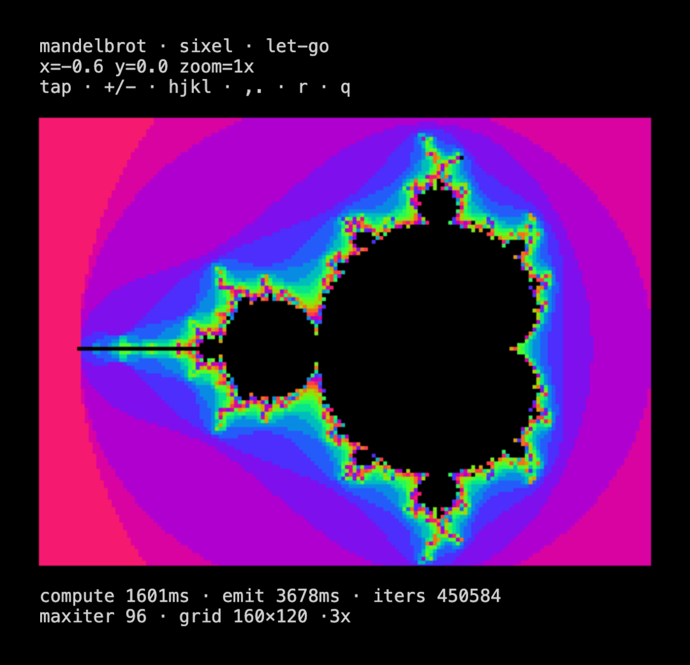
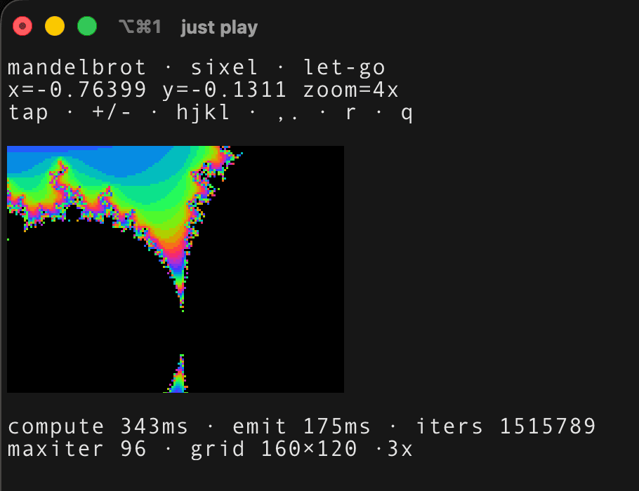

# let-go-lab

Experiments on [let-go](https://github.com/nooga/let-go) — sixel graphics,
terminal UI, wasm-in-the-browser — decoupled from any one client app.

**▶ [Try the mandelbrot demo in your browser](https://mparrett.github.io/let-go-lab/)** — live, no install (let-go compiled to WASM, running in xterm.js).



## Quick start

```sh
just play            # native TUI (needs a sixel-capable terminal)
just serve           # build + serve in the browser; open the printed URL
```

Both default to the `mandelbrot` demo and to `./let-go/lg` (the symlinked
checkout). See [CLAUDE.md](CLAUDE.md) for the lg requirement, cert setup for
LAN/phone serving, and how to add a demo.

## Demos

- **mandelbrot** — an escape-time Mandelbrot rendered as sixel graphics in
  xterm.js (and any sixel-capable native terminal): interactive zoom / pan /
  maxiter, tap-to-recenter-zoom, a dim-while-computing cue, live phase timing,
  and a single-pass sixel encoder.

  Controls: `+/-` zoom · `hjkl` / arrows pan · `,/.` maxiter · `r` reset ·
  `q` quit · wheel to zoom. Click to recenter+zoom (shift+click to zoom out) —
  exact in the browser (the shell content-sizes the terminal), and native too
  where the terminal's cell size can be measured (under tmux, or a terminal that
  answers the xterm window-ops), with keyboard pan/zoom as the fallback.

  The same `.lg` runs natively in any sixel-capable terminal (`just play`):

  
