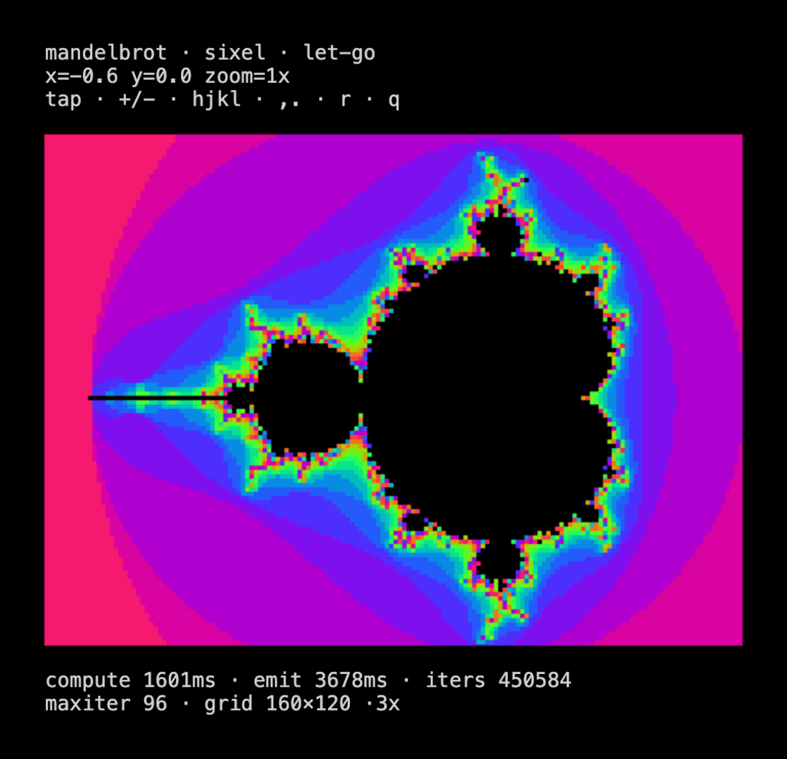
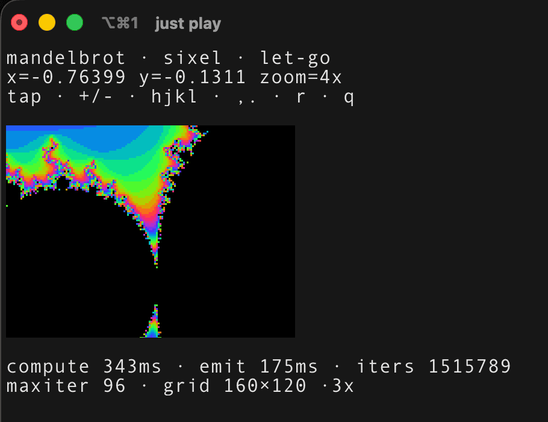

# let-go-lab

Experiments on [let-go](https://github.com/nooga/let-go) — sixel graphics,
terminal UI, wasm-in-the-browser — decoupled from any one client app.

**▶ [Try the mandelbrot demo in your browser](https://mparrett.github.io/let-go-lab/)** — live, no install (let-go compiled to WASM, running in xterm.js).



## Quick start

```sh
just play            # native TUI (needs a sixel-capable terminal)
just serve           # build + serve in the browser; open the printed URL
```

Both default to the `mandelbrot` demo and to the lg in the symlinked checkout
(`./let-go`) — use **let-go ≥ 1.11.0**, and prefer the tag CI pins. See
[CLAUDE.md](CLAUDE.md) for the lg requirement, cert setup for LAN/phone serving,
and how to add a demo.

To compile a complete demo to a native executable:

```sh
just native mandelbrot       # also: pathtrace, microgpt
dist/native/mandelbrot
```

This optional build caches the audited let-go SHA from
[`config/let-go-native.sha`](config/let-go-native.sha). Browser CI and Pages
continue to use v1.13.0. See [native builds](docs/native-builds.md) for requirements,
measurements, and compiler limitations.

## Demos

- **mandelbrot** — an escape-time Mandelbrot rendered as sixel graphics in
  xterm.js (and any sixel-capable native terminal): interactive zoom / pan /
  maxiter, tap-to-recenter (a central tap zooms, an edge tap pans), a
  dim-while-computing cue, live phase timing, and a single-pass sixel encoder.

  Controls: `+/-` zoom · `hjkl` / arrows pan · `,/.` maxiter · `r` reset ·
  `q` quit · wheel to zoom. Click/tap to recenter — a central tap zooms in, an
  edge tap only pans (shift+click zooms out) —
  exact in the browser (the shell content-sizes the terminal), and native too
  where the terminal's cell size can be measured (under tmux, or a terminal that
  answers the xterm window-ops), with keyboard pan/zoom as the fallback.

  The same `.lg` runs natively in any sixel-capable terminal (`just play`):

  

## Experiments

- **[aot](experiments/aot)** — the mandelbrot kernel lowered to native Go through
  `lg compile`, against the VM and a hand-written Go port.
- **[microgpt](experiments/microgpt)** — Karpathy's scalar GPT in one let-go
  file: train on the VM or natively, sample in the browser, and check numerical
  agreement with Python. Includes trained weights and reproducible timings.
- **[cueplay](experiments/cueplay)** — intro-then-gapless-loop cue player on
  oto, with no cgo: the prototype for let-go's native audio binding (nooga/let-go#255).
