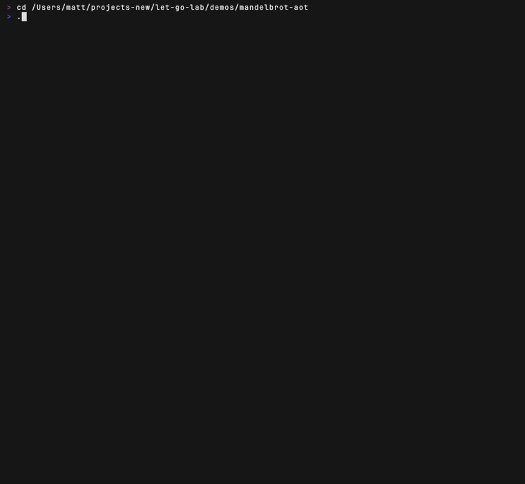

# mandelbrot-aot — a let-go kernel lowered to native Go

Companion to the sixel [`mandelbrot`](../mandelbrot) demo, but from the other
direction: instead of running the fractal on the **bytecode VM**, this lowers the
hot `escape` kernel from `.lg` to **native Go** (`lg-compile` → typed Go → `go
build`) and runs it as a compiled binary. Same math, ~**72×** faster, bit-for-bit
identical output.

It's a worked example of the AOT-native path — what works today, and where it's
still hand-wired (see nooga/let-go#425).



*The AOT-lowered `escape` running a live zoom — `compute` per frame is a few ms; the same workload on the bytecode VM is ~48ms/frame (`zoom-vm.lg`).*

## What it shows

- **`kernel.lg`** — the escape-time kernel with `^double` param hints
  (`(defn escape [^double cx ^double cy mi] …)`) plus the grid coords
  `(* 0.03125 col)` (int × float). The hints are load-bearing: they're why the
  params lower to native `float64` instead of `int`.
- **`gen/aot/kernel/kernel.go`** (generated) — the lowered result:
  `func Escape(ec *vm.ExecContext, cx float64, cy float64, mi int) int` — a raw
  `for` loop on unboxed `float64`, no VM dispatch, no boxing. `CxOf(col int)
  float64` widens the int column (nooga/let-go#534).
- **`native/main.go`** — a thin Go `main` that calls the lowered funcs directly.
  For a pure kernel the "driver" is trivial; no VM boot needed.
- **`vm.lg` / `zoom-vm.lg`** — the same workload on the bytecode VM, for the
  side-by-side comparison.

## Build & run

Needs a **let-go ≥ 1.12** checkout (the `^double` AOT param hints, #357/#534).
`build.sh` defaults to the repo's `../../let-go` symlink; override with `LG=`.

```sh
./build.sh                      # or: LG=/path/to/let-go-1.12 ./build.sh
./mandel-native zoom 240 0 0    # uncapped zoom (delay=0) — feel the speed
./mandel-native ascii           # static plain-ASCII fractal
./mandel-native bench           # native-vs-VM timing (checksums must match)
```

`zoom` params: `zoom [frames] [startFrame] [delayMs] [stepPct]`. The status line
prints `frame / span / mi / compute / delay`; an fps summary goes to stderr at
exit. Compare against the VM:

```sh
../../let-go/lg zoom-vm.lg       # same zoom, interpreted (~48ms/frame vs ~2ms native)
```

## Two things this demo taught (worth knowing)

1. **The speed is in the typed args.** `escape` lowers to unboxed `float64` and
   loses the VM's per-op dispatch + boxing — that's the ~72×. Unhinted, the same
   kernel lowers to `int` params and silently truncates (the open half of #357,
   tracked as float-param inference).
2. **Rapid-redraw ANSI tears without synchronized output.** The color zoom is
   ~88KB/frame; without DEC private mode 2026 (begin/end synchronized update) the
   terminal composites half-drawn frames — a "copy-paste" glitch that self-heals.
   Wrapping each frame in `\e[?2026h … \e[?2026l` fixes it (same technique as
   xsofy's render pipeline). Plain ASCII (~9KB/frame) doesn't tear.

## Status / caveats

- **Hand-wired, by design.** `build.sh` `cd`s into the let-go checkout so
  `lg-compile` can resolve gogen's classpath source — gogen isn't self-contained
  yet (nooga/let-go#425 Item 2). A turnkey `lg build` would remove that.
- **`gen/` and `mandel-native` are build artifacts** (gitignored); run `build.sh`
  to regenerate.
